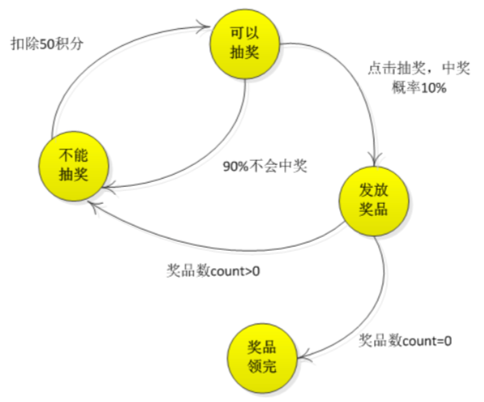
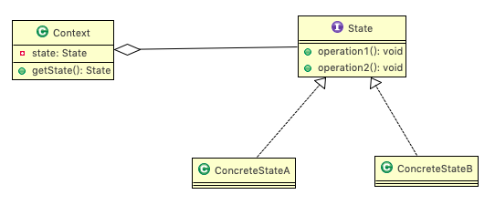
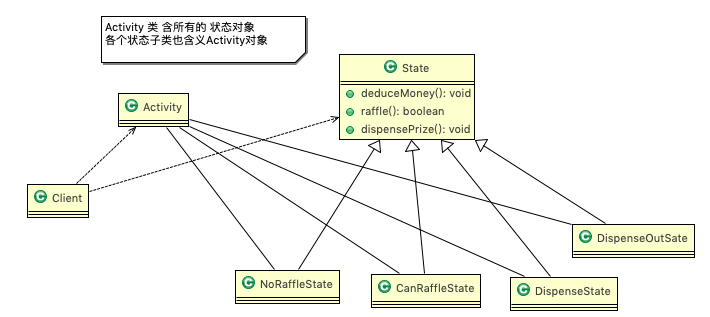
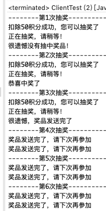
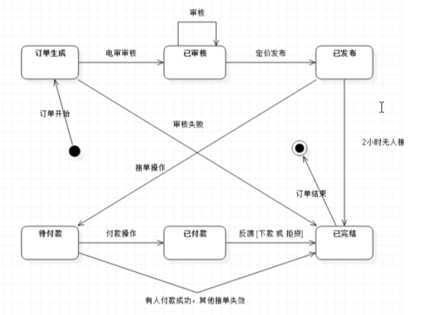
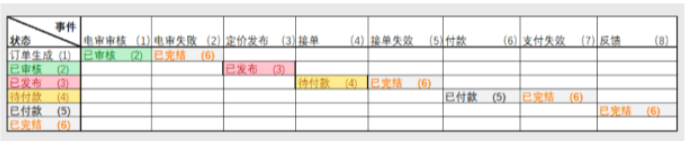
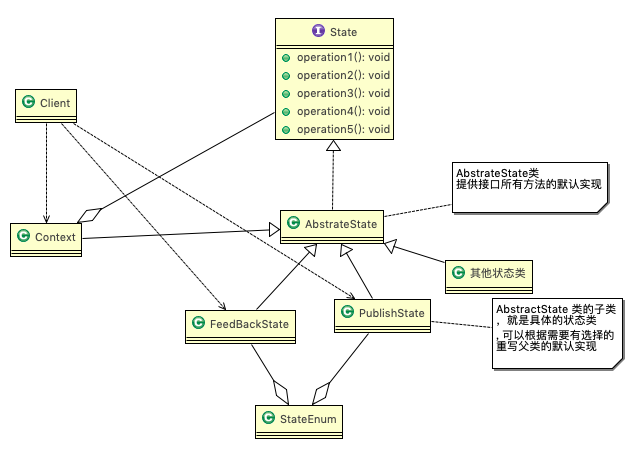
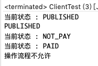

# 24.1 APP抽奖活动问题


1. 假如每参加一次这个活动要扣除用户50积分，中奖概率是10%。
2. 奖品数量固定，抽完就不能抽奖。
3. 活动有四个状态: 可以抽奖、不能抽奖、发放奖品和奖品领完。
4. 活动的四个状态转换关系图(下图)




# 24.2 状态模式

## 24.2.1 基本介绍


1. 状态模式(StatePattern):它主要用来解决对象在多种状态转换时，需要对外输出不同的行为的问题。状态和行为是一一对应的，状态之间可以相互转换。
2. 当一个对象的内在状态改变时，允许改变其行为，这个对象看起来像是改变了其类。


## 24.2.2 原理类图




1.  Context 类为环境角色，用于维护State实例，这个实例定义当前状态。
2. State 是抽象状态角色，定义一个接口封装与 Context 的一个特点接口相关行为。
3. ConcreteState 具体的状态角色，每个子类实现一个与 Context 的一个状态相关行为。


# 24.3 状态模式解决 APP 抽奖问题

## 24.3.1 思路分析和图解(类图)




1. 定义出一个接口叫状态接口，每个状态都实现它。
2. 接口有扣除积分方法、抽奖方法、发放奖品方法。


## 24.3.2 代码实现


```java
package com.atguigu.state;

/**
 * 状态抽象类
 */
public abstract class State {
	// 扣除积分 - 50
    public abstract void deductMoney();
    // 是否抽中奖品
    public abstract boolean raffle();
    // 发放奖品
    public abstract  void dispensePrize();
}
```


```java
package com.atguigu.state;

/**
 * 不能抽奖状态
 */
public class NoRaffleState extends State {

	 // 初始化时传入活动引用，扣除积分后改变其状态
    RaffleActivity activity;

    public NoRaffleState(RaffleActivity activity) {
        this.activity = activity;
    }

    // 当前状态可以扣积分 , 扣除后，将状态设置成可以抽奖状态
    @Override
    public void deductMoney() {
        System.out.println("扣除50积分成功，您可以抽奖了");
        activity.setState(activity.getCanRaffleState());
    }

    // 当前状态不能抽奖
    @Override
    public boolean raffle() {
        System.out.println("扣了积分才能抽奖喔！");
        return false;
    }

    // 当前状态不能发奖品
    @Override
    public void dispensePrize() {
        System.out.println("不能发放奖品");
    }
}
```

```java
package com.atguigu.state;

import java.util.Random;

/**
 * 可以抽奖的状态
 */
public class CanRaffleState extends State {

    RaffleActivity activity;

    public CanRaffleState(RaffleActivity activity) {
        this.activity = activity;
    }

    //已经扣除了积分，不能再扣
    @Override
    public void deductMoney() {
        System.out.println("已经扣取过了积分");
    }

    //可以抽奖, 抽完奖后，根据实际情况，改成新的状态
    @Override
    public boolean raffle() {
        System.out.println("正在抽奖，请稍等！");
        Random r = new Random();
        int num = r.nextInt(10);
        // 10%中奖机会
        if(num == 0){
            // 改变活动状态为发放奖品 context
            activity.setState(activity.getDispenseState());
            return true;
        }else{
            System.out.println("很遗憾没有抽中奖品！");
            // 改变状态为不能抽奖
            activity.setState(activity.getNoRafflleState());
            return false;
        }
    }

    // 不能发放奖品
    @Override
    public void dispensePrize() {
        System.out.println("没中奖，不能发放奖品");
    }
}
```

```java
package com.atguigu.state;

/**
 * 发放奖品的状态
 */
public class DispenseState extends State {

	 // 初始化时传入活动引用，发放奖品后改变其状态
    RaffleActivity activity;

    public DispenseState(RaffleActivity activity) {
        this.activity = activity;
    }

    @Override
    public void deductMoney() {
        System.out.println("不能扣除积分");
    }

    @Override
    public boolean raffle() {
        System.out.println("不能抽奖");
        return false;
    }

    //发放奖品
    @Override
    public void dispensePrize() {
        if(activity.getCount() > 0){
            System.out.println("恭喜中奖了");
            // 改变状态为不能抽奖
            activity.setState(activity.getNoRafflleState());
        }else{
            System.out.println("很遗憾，奖品发送完了");
            // 改变状态为奖品发送完毕, 后面我们就不可以抽奖
            activity.setState(activity.getDispensOutState());
            //System.out.println("抽奖活动结束");
            //System.exit(0);
        }
    }
}
```

```java
package com.atguigu.state;

/**
 * 奖品发放完毕状态
 * 说明，当我们activity 改变成 DispenseOutState， 抽奖活动结束
 */
public class DispenseOutState extends State {
	// 初始化时传入活动引用
    RaffleActivity activity;

    public DispenseOutState(RaffleActivity activity) {
        this.activity = activity;
    }
    @Override
    public void deductMoney() {
        System.out.println("奖品发送完了，请下次再参加");
    }

    @Override
    public boolean raffle() {
        System.out.println("奖品发送完了，请下次再参加");
        return false;
    }

    @Override
    public void dispensePrize() {
        System.out.println("奖品发送完了，请下次再参加");
    }
}
```


```java
package com.atguigu.state;

/**
 * 抽奖活动 
 */
public class RaffleActivity {

	// state 表示活动当前的状态，是变化
    State state = null;
    // 奖品数量
    int count = 0;
    
    // 四个属性，表示四种状态
    State noRafflleState = new NoRaffleState(this);
    State canRaffleState = new CanRaffleState(this);
    
    State dispenseState =   new DispenseState(this);
    State dispensOutState = new DispenseOutState(this);

    //构造器
    //1. 初始化当前的状态为 noRafflleState（即不能抽奖的状态）
    //2. 初始化奖品的数量 
    public RaffleActivity( int count) {
        this.state = getNoRafflleState();
        this.count = count;
    }

    //扣分, 调用当前状态的 deductMoney
    public void debuctMoney(){
        state.deductMoney();
    }

    //抽奖 
    public void raffle(){
    	// 如果当前的状态是抽奖成功
        if(state.raffle()){
        	//领取奖品
            state.dispensePrize();
        }
    }

    //这里请大家注意，每领取一次奖品，count--
    public int getCount() {
    	int curCount = count; 
    	count--;
        return curCount;
    }

   //剩余的getter setter...
}

```


```java
package com.atguigu.state;

/**
 * 状态模式测试类
 */
public class ClientTest {

	public static void main(String[] args) {
		// 创建活动对象，奖品有1个奖品
        RaffleActivity activity = new RaffleActivity(1);

        // 我们连续抽30次奖
        for (int i = 0; i < 30; i++) {
            System.out.println("--------第" + (i + 1) + "次抽奖----------");
            // 参加抽奖，第一步点击扣除积分
            activity.debuctMoney();
            // 第二步抽奖
            activity.raffle();
        }
	}

}
```




# 24.4 在实际项目-借贷平台 源码剖析

## 24.4.1 项目背景


借贷平台的订单，有审核-发布-抢单 等等步骤，随着操作的不同，会改变订单的状态，项目中的这个模块实现就会使用到状态模式


状态模式本质上是一种基于状态和事件的状态机，下面是订单流程的状态图




通过状态图，我们再设计一张横纵坐标关系表来比较，图如下




## 24.4.2 传统方法

### 1.伪代码


通常通过if/else判断订单的状态，从而实现不同的逻辑，伪代码如下

```java
if(审核){ 
    //审核逻辑
} else if(发布){ 
    //发布逻辑 
} else if(接单){ 
    //接单逻辑
}
```


### 2.问题分析 


这类代码难以应对变化，在添加一种状态时，我们需要手动添加if/else，在添加一种功能时，要对所有的状态进行判断。因此代码会变得越来越臃肿，并且一旦没有处理某个状态， 便会发生极其严重的BUG，难以维护


## 24.4.3 状态模式

### 1.思路分析和图解(类图)




### 2.代码实现


```java
package com.atguigu.state.money;

/**
 * 状态接口
 */
public interface State {

	/**
     * 电审
     */
    void checkEvent(Context context);

    /**
     * 电审失败
     */
    void checkFailEvent(Context context);

    /**
     * 定价发布
     */
    void makePriceEvent(Context context);

    /**
     * 接单
     */
    void acceptOrderEvent(Context context);

    /**
     * 无人接单失效
     */
    void notPeopleAcceptEvent(Context context);

    /**
     * 付款
     */
    void payOrderEvent(Context context);

    /**
     * 接单有人支付失效
     */
    void orderFailureEvent(Context context);

    /**
     * 反馈
     */
    void feedBackEvent(Context context);


    String getCurrentState();
}
```

```java
package com.atguigu.state.money;

public abstract class AbstractState implements State {

	protected static final RuntimeException EXCEPTION = new RuntimeException("操作流程不允许");

	//抽象类，默认实现了 State 接口的所有方法
	//该类的所有方法，其子类(具体的状态类)，可以有选择的进行重写
	
    @Override
    public void checkEvent(Context context) {
        throw EXCEPTION;
    }

    @Override
    public void checkFailEvent(Context context) {
        throw EXCEPTION;
    }

    @Override
    public void makePriceEvent(Context context) {
        throw EXCEPTION;
    }

    @Override
    public void acceptOrderEvent(Context context) {
        throw EXCEPTION;
    }

    @Override
    public void notPeopleAcceptEvent(Context context) {
        throw EXCEPTION;
    }

    @Override
    public void payOrderEvent(Context context) {
        throw EXCEPTION;
    }

    @Override
    public void orderFailureEvent(Context context) {
        throw EXCEPTION;
    }

    @Override
    public void feedBackEvent(Context context) {
        throw EXCEPTION;
    }
}
```

```java
package com.atguigu.state.money;

//各种具体状态类
class FeedBackState extends AbstractState {

	@Override
	public String getCurrentState() {
		return StateEnum.FEED_BACKED.getValue();
	}
}

class GenerateState extends AbstractState {

	@Override
	public void checkEvent(Context context) {
		context.setState(new ReviewState());
	}

	@Override
	public void checkFailEvent(Context context) {
		context.setState(new FeedBackState());
	}

	@Override
	public String getCurrentState() {
		return StateEnum.GENERATE.getValue();
	}
}

class NotPayState extends AbstractState {

	@Override
	public void payOrderEvent(Context context) {
		context.setState(new PaidState());
	}

	@Override
	public void feedBackEvent(Context context) {
		context.setState(new FeedBackState());
	}

	@Override
	public String getCurrentState() {
		return StateEnum.NOT_PAY.getValue();
	}
}

class PaidState extends AbstractState {

	@Override
	public void feedBackEvent(Context context) {
		context.setState(new FeedBackState());
	}

	@Override
	public String getCurrentState() {
		return StateEnum.PAID.getValue();
	}
}

class PublishState extends AbstractState {

	@Override
	public void acceptOrderEvent(Context context) {
		//把当前状态设置为  NotPayState。。。
		//至于应该变成哪个状态，有流程图来决定
		context.setState(new NotPayState());
	}

	@Override
	public void notPeopleAcceptEvent(Context context) {
		context.setState(new FeedBackState());
	}

	@Override
	public String getCurrentState() {
		return StateEnum.PUBLISHED.getValue();
	}
}

class ReviewState extends AbstractState {

	@Override
	public void makePriceEvent(Context context) {
		context.setState(new PublishState());
	}

	@Override
	public String getCurrentState() {
		return StateEnum.REVIEWED.getValue();
	}
}
```


```java
package com.atguigu.state.money;

//环境上下文
public class Context extends AbstractState{
	//当前的状态 state, 根据我们的业务流程处理，不停的变化
	private State state;

    @Override
    public void checkEvent(Context context) {
        state.checkEvent(this);
        getCurrentState();
    }

    @Override
    public void checkFailEvent(Context context) {
        state.checkFailEvent(this);
        getCurrentState();
    }

    @Override
    public void makePriceEvent(Context context) {
        state.makePriceEvent(this);
        getCurrentState();
    }

    @Override
    public void acceptOrderEvent(Context context) {
        state.acceptOrderEvent(this);
        getCurrentState();
    }

    @Override
    public void notPeopleAcceptEvent(Context context) {
        state.notPeopleAcceptEvent(this);
        getCurrentState();
    }

    @Override
    public void payOrderEvent(Context context) {
        state.payOrderEvent(this);
        getCurrentState();
    }

    @Override
    public void orderFailureEvent(Context context) {
        state.orderFailureEvent(this);
        getCurrentState();
    }

    @Override
    public void feedBackEvent(Context context) {
        state.feedBackEvent(this);
        getCurrentState();
    }

    public State getState() {
        return state;
    }

    public void setState(State state) {
        this.state = state;
    }

    @Override
    public String getCurrentState() {
        System.out.println("当前状态 : " + state.getCurrentState());
        return state.getCurrentState();
    }
}
```


```java
package com.atguigu.state.money;

/**测试类*/
public class ClientTest {

	public static void main(String[] args) {
		//创建context 对象
		Context context = new Context();
        //将当前状态设置为 PublishState
		context.setState(new PublishState());
        System.out.println(context.getCurrentState());
        
//        //publish --> not pay
        context.acceptOrderEvent(context);
//        //not pay --> paid
        context.payOrderEvent(context);
//        // 失败, 检测失败时，会抛出异常
        try {
        	context.checkFailEvent(context);
        	System.out.println("流程正常..");
		} catch (Exception e) {
			System.out.println(e.getMessage());
		}
	}

}
```




# 24.5 状态模式的注意事项和细节


1. 代码有很强的==可读性==。状态模式将每个状态的行为封装到对应的一个类中。
2. ==方便维护==。将容易产生问题的if-else语句删除了，如果把每个状态的行为都放到一个类中，每次调用方法时都要判断当前是什么状态，不但会产出很多 if-else 语句，而且容易出错。
3. 符合"开闭原则"。容易增删状态。
4. 会产生很多类。每个状态都要一个对应的类，当状态过多时会产生很多类，加大维护难度。
5. 应用场景:当一个事件或者对象有很多种状态，状态之间会相互转换，对不同的状态要求有不同的行为的时候，可以考虑使用状态模式。