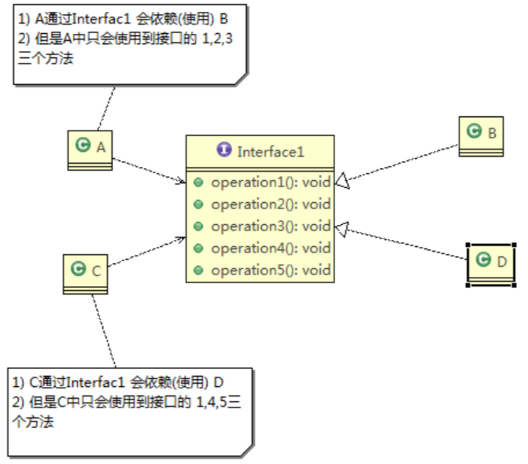
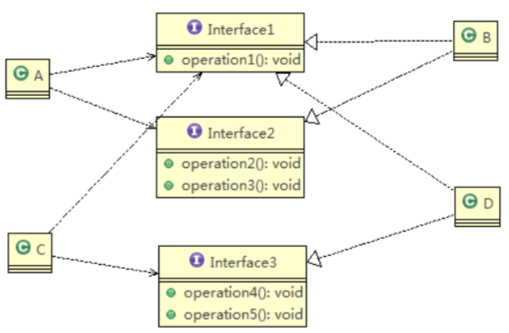

# 2.1 设计模式七大原则 

设计模式原则，其实就是==程序员在编程时，应当遵守的原则==，也是各种设计模式的基础(即:==设计模式为什么，这样设计的依据==)

设计模式常用的七大原则有: 

1. 单一职责原则
2. 接口隔离原则
3. 依赖倒转(倒置)原则 
4. 里氏替换原则 
5. 开闭原则
6. 迪米特法则 
7. 合成复用原则 


# 2.2 单一职责原则 

## 2.2.1 基本介绍 

对类来说的，==即一个类应该只负责一项职责==。如类A负责两个不同职责:职责1，职责2。 当职责1需求变更而改变A时，可能造成职责2执行错误，所以需要将类A的粒度分解为 A1，A2 

## 2.2.2 应用实例 

以交通工具案例

1. 方案1 [分析说明] 

```java
package com.atguigu.principle.singleresponsibility;

public class SingleResponsibility1 {

	public static void main(String[] args) {
		// TODO Auto-generated method stub
		Vehicle vehicle = new Vehicle();
		vehicle.run("摩托车");
		vehicle.run("汽车");
		vehicle.run("飞机");
	}

}

// 交通工具类
// 方式1
// 1. 在方式1 的run方法中，违反了单一职责原则
// 2. 解决的方案非常的简单，根据交通工具运行方法不同，分解成不同类即可
class Vehicle {
	public void run(String vehicle) {
		System.out.println(vehicle + " 在公路上运行....");
	}
}
```

2. 方案2 [分析说明] 

```java
package com.atguigu.principle.singleresponsibility;

public class SingleResponsibility2 {

	public static void main(String[] args) {
		// TODO Auto-generated method stub
		RoadVehicle roadVehicle = new RoadVehicle();
		roadVehicle.run("摩托车");
		roadVehicle.run("汽车");
		
		AirVehicle airVehicle = new AirVehicle();
		airVehicle.run("飞机");
	}
}

//方案2的分析
//1. 遵守单一职责原则
//2. 但是这样做的改动很大，即将类分解，同时修改客户端
//3. 改进：直接修改Vehicle 类，改动的代码会比较少=>方案3

class RoadVehicle {
	public void run(String vehicle) {
		System.out.println(vehicle + "公路运行");
	}
}

class AirVehicle {
	public void run(String vehicle) {
		System.out.println(vehicle + "天空运行");
	}
}

class WaterVehicle {
	public void run(String vehicle) {
		System.out.println(vehicle + "水中运行");
	}
}
```

3. 方案3 [分析说明] 

```java
package com.atguigu.principle.singleresponsibility;

public class SingleResponsibility3 {

	public static void main(String[] args) {
		// TODO Auto-generated method stub
		Vehicle2 vehicle2  = new Vehicle2();
		vehicle2.run("汽车");
		vehicle2.runWater("轮船");
		vehicle2.runAir("飞机");
	}

}

//方式3的分析
//1. 这种修改方法没有对原来的类做大的修改，只是增加方法
//2. 这里虽然没有在类这个级别上遵守单一职责原则，但是在方法级别上，仍然是遵守单一职责
class Vehicle2 {
	public void run(String vehicle) {
		//处理
		System.out.println(vehicle + " 在公路上运行....");
	}
	
	public void runAir(String vehicle) {
		System.out.println(vehicle + " 在天空上运行....");
	}
	
	public void runWater(String vehicle) {
		System.out.println(vehicle + " 在水中行....");
	}
	
	//方法2.
	//..
	//..
	
	//...
}
```

## 2.2.3 单一职责原则注意事项和细节 

1. 降低类的复杂度，一个类只负责一项职责。

2. 提高类的可读性，可维护性
3. 降低变更引起的风险
4. 通常情况下，==我们应当遵守单一职责原则==，只有逻辑足够简单，才可以在代码级违反单一职责原则;只有类中方法数量足够少，可以在方法级别保持单一职责原则

 

# 2.3 接口隔离原则(Interface Segregation Principle) 

## 2.3.1 基本介绍 

1. 客户端不应该依赖它不需要的接口，即一个类对另一个类的依赖应该建立在最小的接口上 

2. 先看一张图: 

   

3. 类A通过接口Interface1依赖类B，类C通过接口Interface1依赖类D，如果接口 Interface1对于类A和类C来说不是最小接口， 那么类B和类D必须去实现他们不需要的方法。 

4. 按隔离原则应当这样处理: 

   将==接口 Interface1== 拆分为==独立的几个接口(这里我们拆分成 3 个接口)==，类 A 和类 C 分别与他们需要的接口建立依赖关系。也就是采用接口隔离原则 

## 2.3.2 应用实例

1. 类A通过接口Interface1依赖类B，类C通过接口Interface1依赖类D，请编写代码完成此应用实例。 
2. 没有使用接口隔离原则代码 

```java
package com.atguigu.principle.segregation;

public class Segregation1 {

	public static void main(String[] args) {
		// TODO Auto-generated method stub

	}

}

//接口
interface Interface1 {
	void operation1();
	void operation2();
	void operation3();
	void operation4();
	void operation5();
}

class B implements Interface1 {
	public void operation1() { System.out.println("B 实现了 operation1"); }
	public void operation2() { System.out.println("B 实现了 operation2"); }
	public void operation3() { System.out.println("B 实现了 operation3"); }
	public void operation4() { System.out.println("B 实现了 operation4"); }
	public void operation5() { System.out.println("B 实现了 operation5"); }
}

class D implements Interface1 {
	public void operation1() { System.out.println("D 实现了 operation1"); }
	
	public void operation2() { System.out.println("D 实现了 operation2"); }
	public void operation3() { System.out.println("D 实现了 operation3"); }
	public void operation4() { System.out.println("D 实现了 operation4"); }
	public void operation5() { System.out.println("D 实现了 operation5"); }
}

class A { //A 类通过接口Interface1 依赖(使用) B类，但是只会用到1,2,3方法
	public void depend1(Interface1 i) { i.operation1(); }
	public void depend2(Interface1 i) { i.operation2(); }
	public void depend3(Interface1 i) { i.operation3(); }
}
  
class C { //C 类通过接口Interface1 依赖(使用) D类，但是只会用到1,4,5方法
	public void depend1(Interface1 i) { i.operation1(); }
	public void depend4(Interface1 i) { i.operation4(); }
	public void depend5(Interface1 i) { i.operation5(); }
}
```

## 2.3.3 应传统方法的问题和使用接口隔离原则改进 

1. 类A通过接口Interface1依赖类B，类C通过接口Interface1依赖类D，如果接口Interface1对于类A和类C 

   来说不是最小接口，那么类 B 和类 D 必须去实现他们不需要的方法 

2. 将==接口Interface1拆分为独立的几个接口==，类A和类C分别与他们需要的接口建立依赖关系。也就是采用接口 隔离原则 

3. 接口Interface1中出现的方法，根据实际情况拆分为三个接口 



4. 代码实现 

```java
package com.atguigu.principle.segregation.improve;

public class Segregation1 {

	public static void main(String[] args) {
		// TODO Auto-generated method stub
		// 使用一把
		A a = new A();
		a.depend1(new B()); // A类通过接口去依赖B类
		a.depend2(new B());
		a.depend3(new B());

		C c = new C();

		c.depend1(new D()); // C类通过接口去依赖(使用)D类
		c.depend4(new D());
		c.depend5(new D());
	}
}

// 接口1
interface Interface1 {
	void operation1();
}

// 接口2
interface Interface2 {
	void operation2();
	void operation3();
}

// 接口3
interface Interface3 {
	void operation4();
	void operation5();
}

class B implements Interface1, Interface2 {
	public void operation1() { System.out.println("B 实现了 operation1"); }
	public void operation2() { System.out.println("B 实现了 operation2"); }
	public void operation3() { System.out.println("B 实现了 operation3"); }
}

class D implements Interface1, Interface3 {
	public void operation1() { System.out.println("D 实现了 operation1"); }
	public void operation4() { System.out.println("D 实现了 operation4"); }
	public void operation5() { System.out.println("D 实现了 operation5"); }
}

class A { // A 类通过接口Interface1,Interface2 依赖(使用) B类，但是只会用到1,2,3方法
	public void depend1(Interface1 i) { i.operation1(); }
	public void depend2(Interface2 i) { i.operation2(); }
	public void depend3(Interface2 i) { i.operation3(); }
}

class C { // C 类通过接口Interface1,Interface3 依赖(使用) D类，但是只会用到1,4,5方法
	public void depend1(Interface1 i) { i.operation1(); }
	public void depend4(Interface3 i) { i.operation4(); }
	public void depend5(Interface3 i) { i.operation5(); }
}
```

# 2.4 依赖倒转原则(Dependence Inversion Principle )

## 2.4.1 基本介绍 

1. 高层模块不应该依赖低层模块，二者都应该依赖其抽象。
2. ==抽象不应该依赖细节，细节应该依赖抽象==。
3. 依赖倒转(倒置)的中心思想是==面向接口编程==。
4. 依赖倒转原则是基于这样的设计理念:相对于细节的多变性，抽象的东西要稳定的多。以抽象为基础搭建的架 构比以细节为基础的架构要稳定的多。在 java 中，抽象指的是接口或抽象类，细节就是具体的实现类。
5. 使用==接口或抽象类==的目的是制定好==规范==，而不涉及任何具体的操作，把==展现细节的任务交给他们的实现类==去完 成  

## 2.4.2 应用实例

请编程完成 Person 接收消息的功能。 

1. 实现方案1+分析说明 

```java
package com.atguigu.principle.inversion;

public class DependecyInversion {

	public static void main(String[] args) {
		Person person = new Person();
		person.receive(new Email());
	}

}

class Email {
	public String getInfo() { return "电子邮件信息: hello,world"; }
}

//完成Person接收消息的功能
//方式1分析
//1. 简单，比较容易想到
//2. 如果我们获取的对象是 微信，短信等等，则新增类，同时Perons也要增加相应的接收方法
//3. 解决思路：引入一个抽象的接口IReceiver, 表示接收者, 这样Person类与接口IReceiver发生依赖
//   因为Email, WeiXin 等等属于接收的范围，他们各自实现IReceiver接口就ok, 这样我们就符号依赖倒转原则
class Person {
	public void receive(Email email ) {
		System.out.println(email.getInfo());
	}
}
```

2. 实现方案2(依赖倒转)+分析说明 

```java
package com.atguigu.principle.inversion.improve;

public class DependecyInversion {

	public static void main(String[] args) {
		//客户端无需改变
		Person person = new Person();
		person.receive(new Email());
		
		person.receive(new WeiXin());
	}

}

//定义接口
interface IReceiver { public String getInfo();}

class Email implements IReceiver {
	public String getInfo() { return "电子邮件信息: hello,world"; }
}

//增加微信
class WeiXin implements IReceiver {
	public String getInfo() { return "微信信息: hello,ok"; }
}

//方式2
class Person {
	//这里我们是对接口的依赖
	public void receive(IReceiver receiver ) {
		System.out.println(receiver.getInfo());
	}
}
```

## 2.4.3 依赖关系传递的三种方式和应用案例 

1. 接口传递 

```java
package com.atguigu.principle.inversion.improve;

public class DependencyPass {

    public static void main(String[] args) {
        ChangHong changHong = new ChangHong();
        OpenAndClose openAndClose = new OpenAndClose();
        openAndClose.open(changHong);
    }
}

// 方式1： 通过接口传递实现依赖
// 开关的接口
interface IOpenAndClose {
    public void open(ITV tv); //抽象方法,接收接口
}

interface ITV { //ITV接口
    public void play();
}

class ChangHong implements ITV {
    @Override
    public void play() {
        System.out.println("长虹电视机，打开");
    }
}

// 实现接口
class OpenAndClose implements IOpenAndClose {
    public void open(ITV tv) {
        tv.play();
    }
}
```

2. 构造方法传递 

```java
package com.atguigu.principle.inversion.improve;

public class DependencyPass {

    public static void main(String[] args) {
        ChangHong changHong = new ChangHong();
        //通过构造器进行依赖传递
        OpenAndClose openAndClose = new OpenAndClose(changHong);
        openAndClose.open();
    }
}

// 方式2: 通过构造方法依赖传递
interface IOpenAndClose {
    public void open(); //抽象方法
}

interface ITV { //ITV接口
    public void play();
}

class ChangHong implements ITV {
    @Override
    public void play() {
        System.out.println("长虹电视机，打开");
    }
}

class OpenAndClose implements IOpenAndClose {
    public ITV tv; //成员

    public OpenAndClose(ITV tv) { //构造器
        this.tv = tv;
    }

    public void open() {
        this.tv.play();
    }
}

```

3. setter方式传递 

```java
package com.atguigu.principle.inversion.improve;

public class DependencyPass {

    public static void main(String[] args) {
        ChangHong changHong = new ChangHong();
        //通过setter方法进行依赖传递
        OpenAndClose openAndClose = new OpenAndClose();
        openAndClose.setTv(changHong);
        openAndClose.open();
    }
}

// 方式3 , 通过setter方法传递
interface IOpenAndClose {
    public void open(); // 抽象方法

    public void setTv(ITV tv);
}

interface ITV { // ITV接口
    public void play();
}

class ChangHong implements ITV {
    @Override
    public void play() {
        System.out.println("长虹电视机，打开");
    }
}

class OpenAndClose implements IOpenAndClose {
    private ITV tv;

    public void setTv(ITV tv) {
        this.tv = tv;
    }

    public void open() {
        this.tv.play();
    }
}
```

## 2.4.4 依赖倒转原则的注意事项和细节

1. 低层模块尽量都要有抽象类或接口，或者两者都有，程序稳定性更好。
2. 变量的声明类型尽量是抽象类或接口, 这样我们的变量引用和实际对象间，就存在一个缓冲层，利于程序扩展和优化。
3. 继承时遵循里氏替换原则。

# 2.5 里氏替换原则

